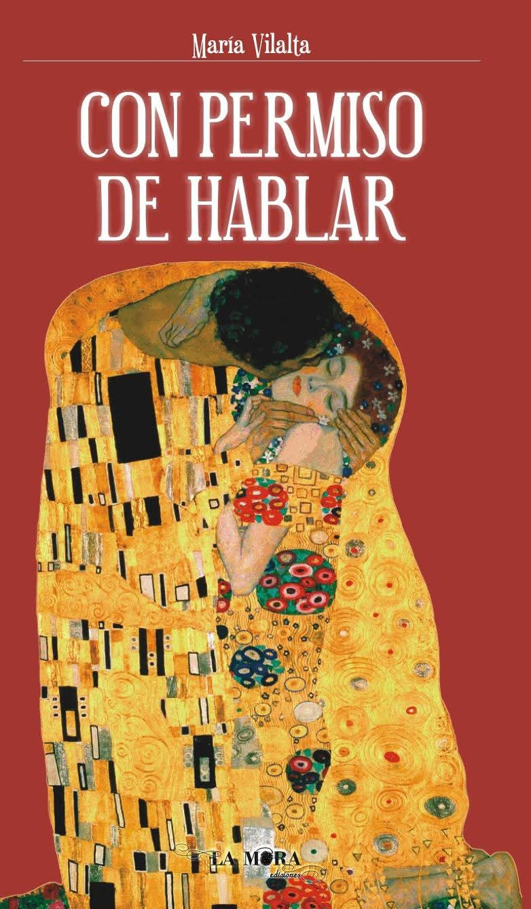
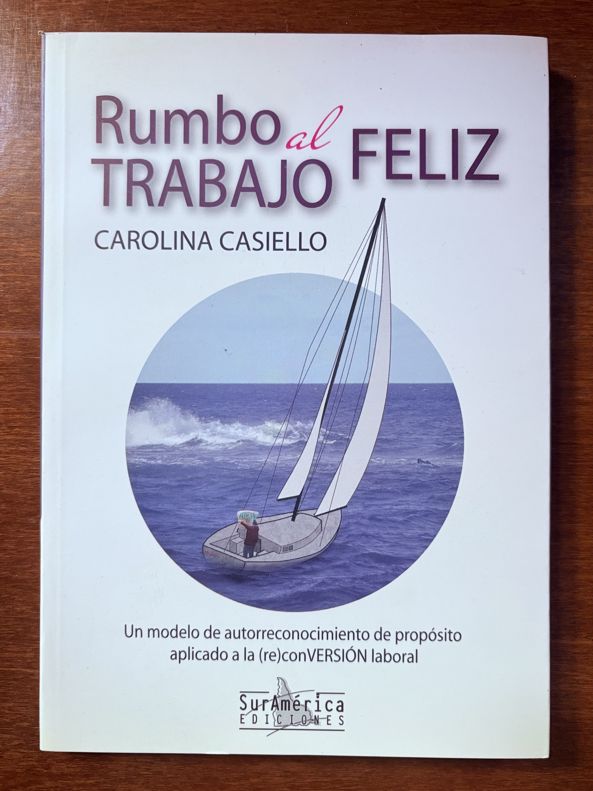
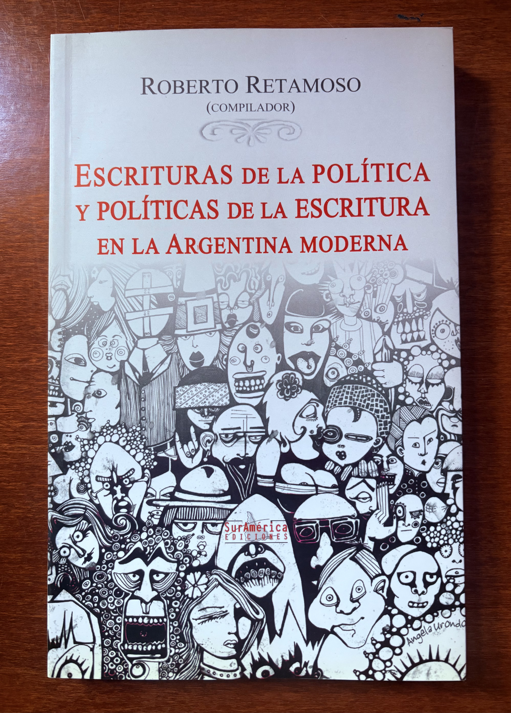
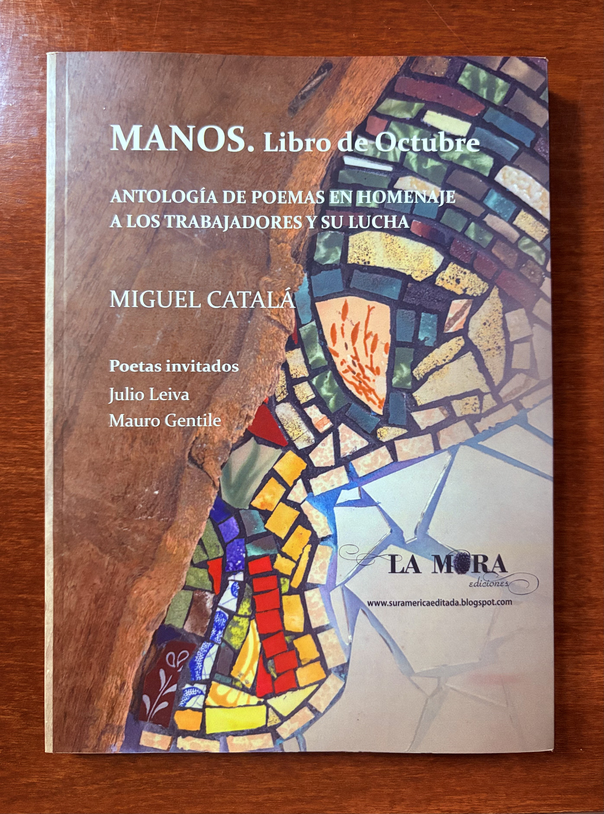

<header>
  

    <h2>📚LATAMBOOK🌐</h2>
    
| Servicios editoriales | Distribuidora para Latinoamérica |

    
📍 Buenos Aires / Rosario – Argentina · ✉️ ventas@latambook.com · IG: <a href="https://instagram.com/latambook" target="_blank">@latambook</a>

  

</header>

  

    

      <h2>Sobre nosotros 🇪🇸</h2>
      
<b>LATAMBOOK</b> opera como distribuidora editorial con red de clientes en toda Latinoamérica. 
         Gestionamos ventas, logística y representación de sellos locales, y también ofrecemos servicios de 
         <i>edición</i>, diseño, traducción, corrección y tramitación de <b>ISBN / código de barras</b> (registrados en la Cámara Argentina del Libro).

      
Desde nuestro sector productivo <b>Editorial La Mora</b> (Rosario, 2010) conectamos autores con sus obras

    

    

      <h2>About us 🇺🇸</h2>
      
<b>LATAMBOOK</b> is a Latin American book distributor with a regional client network. We manage sales, logistics and publisher representation, and provide editorial services (editing, design, translation, copy-editing; <b>ISBN/barcode</b> issuance registered at the Argentine Book Chamber).

      
 From our production sector, <b>La Mora Editions</b> (Rosario, 2010), we connect authors with their works.

    

  

<!-- Línea divisoria entre "About us" y "Servicios editoriales" -->

<!-- Servicios Editoriales -->
<section id="servicios-editoriales" class="grid">
  <!-- Columna Español -->
  

    <h2>Servicios editoriales</h2>
    
From our publishing house La Mora, we manage all stages of the editorial and production process.

    <ul>
      <li><b>Corrección de estilo</b> — revisión lingüística y de coherencia.</li>
      <li><b>Traducción</b> — español ↔ inglés u otros idiomas según proyecto.</li>
      <li><b>Diseño gráfico</b> — creación visual de portada y elementos de identidad.</li>
      <li><b>Diagramación</b> — maquetación del interior del libro (texto, imágenes, márgenes, tipografía, estructura).</li>
      <li><b>Gestión de ISBN y código de barras</b> — tramitación ante la Cámara Argentina del Libro.</li>
      <li><b>Publicación</b> — coordinación de impresión o colocación en plataformas digitales (e-book, print-on-demand, etc.).</li>
    </ul>
  

  <!-- Columna Inglés -->
  

    <h2>Editorial Services</h2>
    
Professional support through every stage of the publishing process.

    <ul>
      <li><b>Copy editing</b> — language and consistency review.</li>
      <li><b>Translation</b> — Spanish ↔ English or other languages depending on the project.</li>
      <li><b>Graphic design</b> — cover art and visual identity creation.</li>
      <li><b>Layout and typesetting</b> — interior design of the book (text flow, images, margins, typography, structure).</li>
      <li><b>ISBN & barcode management</b> — registration with the Argentine Book Chamber.</li>
      <li><b>Publishing</b> — coordination of printing or upload to digital platforms (e-book, print-on-demand, etc.).</li>
    </ul>
  

</section>

<!-- Catálogo | Muestra -->
<section id="catalogo" class="grid">

  <!-- Con permiso de hablar -->
  <article class="card">
    
    <h3>Con permiso de hablar</h3>
    
Autora: María Vilalta · Idioma: Español · Formato: Rústica

  </article>

  <!-- Rumbo al trabajo feliz -->
  <article class="card">
    
    <h3>Rumbo al trabajo feliz</h3>
    
Autora: Carolina Casiello · Idioma: Español · Formato: Rústica

  </article>

  <!-- Portada 2 -->
  <article class="card">
    
    <h3>Título pendiente</h3>
    
Autor/a: (completar) · Idioma: Español · Formato: Rústica

  </article>

  <!-- Portada 3 -->
  <article class="card">
    
    <h3>Título pendiente</h3>
    
Autor/a: (completar) · Idioma: Español · Formato: Rústica

  </article>

</section>
