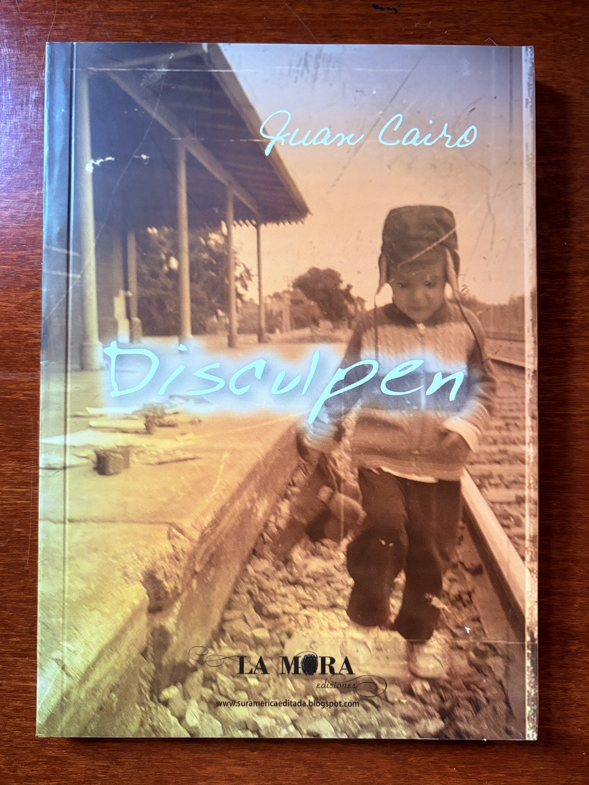
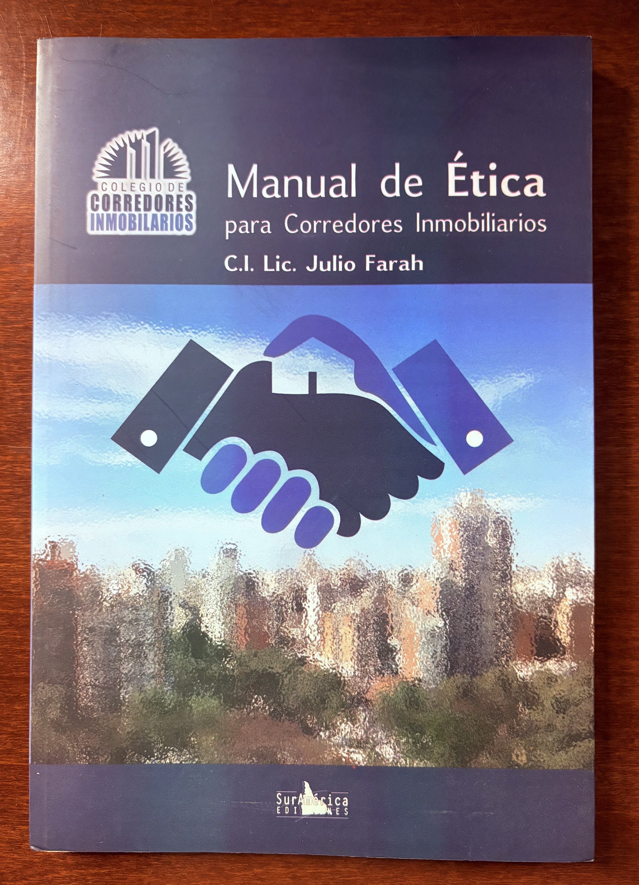
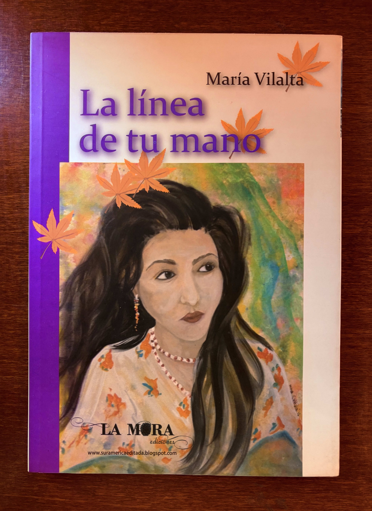
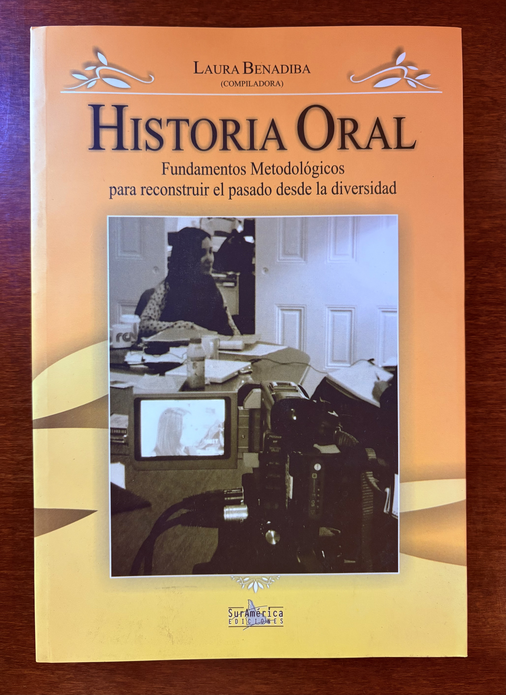
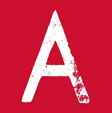
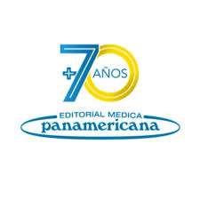

<!-- LOGO -->

  

<header>
  

    <h2>📚 Editorial Services | Distributor for Latin America 🌐</h2>
    

      📞 <a href="https://wa.me/5491151011262">+54 9 11 5101 1262</a> · 
      ✉️ <a href="mailto:ventas@latambook.com">ventas@latambook.com</a> · 
      IG: <a href="https://instagram.com/latambook" target="_blank">@latambook</a>
           📍 <b>Buenos Aires · Rosario | Argentina </b>
    

  

</header>

  

    

      <h2>🇺🇸About us</h2>
      
<b>LATAMBOOK</b> is a Latin American book distributor with a regional client network. We manage sales, logistics and publisher representation, and provide editorial services (editing, design, translation, copy-editing; <b>ISBN/barcode</b> issuance registered at the Argentine Book Chamber).

      
Through our publishing imprints <b>La Mora</b> (literary–poetic) and <b>SurAmerica</b> (specialized in human and social sciences), both founded in 2010, we produce books in both print and digital formats.

    

    

      <h2>🇦🇷Sobre nosotros</h2>
      
<b>LATAMBOOK</b> opera como distribuidora editorial con red de clientes en toda Latinoamérica. Gestionamos ventas, logística y representación de sellos locales, y también ofrecemos servicios de <i>edición</i>, diseño, traducción, corrección y tramitación de <b>ISBN / código de barras</b> (registrados en la Cámara Argentina del Libro).

      
Desde 2010 brindamos servicios editoriales a través de nuestros sellos: <b>La Mora</b> — orientado a poesía y literatura — y <b>SurAmerica ediciones</b> — especializado en Ciencias Humanas y Sociales.

    

  

  

  <section id="servicios-editoriales" class="services-grid">
    

      <h2>🏗️Complete editorial process</h2>
      
Professional support through every stage of the publishing process.

      <ul>
        <li><b>Copy editing</b> — language and consistency review.</li>
        <li><b>Translation</b> — Spanish ↔ English or other languages depending on the project.</li>
        <li><b>Graphic design</b> — cover art and visual identity creation.</li>
        <li><b>Layout and typesetting</b> — interior book design.</li>
        <li><b>ISBN &amp; barcode management</b> — registered with the Argentine Book Chamber.</li>
        <li><b>Publishing</b> — print edition, digital version, print on demand.</li>
        <li><b>Commercialization</b> - representation and distribution</li>
      </ul>
    

    

      <h2>👷‍♀️Servicio editorial integral</h2>
      
Profesionalismo en todas las etapas de producción editorial.

      <ul>
        <li><b>Corrección de estilo</b> — revisión lingüística, coherencia y sentido.</li>
        <li><b>Traducción</b> — español ↔ inglés u otros idiomas.</li>
        <li><b>Diseño gráfico</b> — diseño de portada e identidad visual.</li>
        <li><b>Diagramación</b> — maquetación del interior del libro.</li>
        <li><b>Gestión de ISBN y código de barras</b> — tramitación en la Cámara Argentina del Libro.</li>
        <li><b>Publicación</b> — impresión, versión digital, impresion bajo demanda</li>
        <li><b>Comercialización</b> - representación y distribución</li>
      </ul>
    

  </section>

  <h2>📚Editorial Production Samples💡</h2>

  <section id="catalogo" class="grid">
    <article class="card">
      
      <h3>Con permiso de hablar</h3>
      
Sello: <b>La Mora</b> · Autora: María Vilalta ·ISBN: 9789872445584

    </article>

    <article class="card">
      
      <h3>MANOS. Antología de Poemas</h3>
      
Sello: <b>La Mora</b> · Autor: Miguel Catalá · ISBN: 9789872593742

    </article>

    <article class="card">
      
      <h3>Rumbo al trabajo feliz</h3>
      
Sello: <b>SurAmerica</b> · Autora: Carolina Casiello · ISBN: 9789872593933

    </article>

    <article class="card">
      
      <h3>Escrituras de la política</h3>
      
Sello: <b>SurAmerica</b> · Autor: Roberto Retamoso · ISBN: 9789872593919

    </article>

     <article class="card">
      
      <h3>Disculpen</h3>
      
Sello: <b>La Mora</b> · Autor: Juan Cairo · ISBN: 9789872593735

    </article>

     <article class="card">
      
      <h3>Manual de Etica para corredores inmobiliarios</h3>
      
Sello: <b>SurAmerica</b> · Autor: Lic. Julio Farah · ISBN: 9789872593926

    </article>

    <article class="card">
      
      <h3>La linea de tu mano</h3>
      
Sello: <b>La Mora</b> · Autor: Maria Vilaltas · ISBN: 9789872593728

    </article>

    <article class="card">
      
      <h3>Historia Oral</h3>
      
Sello: <b>SurAmerica</b> · Autor: Laura benadiba · ISBN: 9789872593902

    </article>
    
  </section>

<!-- DISTRIBUCIÓN ACADÉMICA -->
<h2>📚 Academic Book Distribution</h2>

  Specialized distribution of academic, technical and professional books (print & e-books).
  

  

    

      <b>EN</b> — LATAMBOOK is a distributor of academic, professional, and scientific books in Spanish.
Our catalogue includes medicine, nursing, psychology, neuroscience, neurodevelopment, education, technology, economics, social sciences, and humanities.
We provide <strong>👩🏻‍💻commercial management, 📦specialized logistics, and ✈️international DHL shipping worldwide</strong>
    

  

  

    

      <b>ES</b> — LATAMBOOK es una distribuidora de libros académicos, profesionales y científicos en español.
Nuestro catálogo abarca medicina, enfermería, psicología, neurociencias, neurodesarrollo, educación, tecnología, ciencias económicas, ciencias sociales y humanidades.
Ofrecemos <strong>👩🏻‍💻gestión comercial, 📦logística especializada y ✈️envíos internacionales vía DHL</strong> a todo el mundo 
    

  

<!-- ========================= -->
<!--   Separador + Título Sellos en Distribución -->
<!-- ========================= -->

  <h2 style="margin-bottom:4px;">📚 Publishing Houses in Distribution</h2>
  

<!-- Grid de editoriales en distribución -->

  <!-- Manual Moderno -->
  <article class="card">
    
    <h3>Manual Moderno</h3>
    
Medicine · Psychology

    <a href="mailto:ventas@latambook.com?subject=Request%20price%20list%20Manual%20Moderno"
       class="btn">Request price list</a>
  </article>

  <!-- Akadia -->
  <article class="card">
    
    <h3>Akadia</h3>
    
Psychology · Education

    <a href="mailto:ventas@latambook.com?subject=Request%20price%20list%20Akadia"
       class="btn">Request price list</a>
  </article>

  <!-- Neuroaprendizaje Infantil -->
  <article class="card">
    
    <h3>Neuroaprendizaje Infantil</h3>
    
Neurodiversity · Neurodevelopment

    <a href="mailto:ventas@latambook.com?subject=Request%20price%20list%20Neuroaprendizaje%20Infantil"
       class="btn">Request price list</a>
  </article>

  <!-- Amorrortu -->
  <article class="card">
    
    <h3>Amorrortu</h3>
    
Psychology · Social sciences

    <a href="mailto:ventas@latambook.com?subject=Request%20price%20list%20Amorrortu"
       class="btn">Request price list</a>
  </article>

  <!-- Tres Olas -->
  <article class="card">
    
    <h3>Tres Olas</h3>
    
Education · Psychology

    <a href="mailto:ventas@latambook.com?subject=Request%20price%20list%20Tres%20Olas"
       class="btn">Request price list</a>
  </article>

  <!-- Panamericana -->
  <article class="card">
    
    <h3>Panamericana</h3>
    
Medicine · Health sciences

    <a href="mailto:ventas@latambook.com?subject=Request%20price%20list%20Panamericana"
       class="btn">Request price list</a>
  </article>

  <!-- Journal -->
  <article class="card">
    
    <h3>Journal</h3>
    
 Medicine · Neurosciences

    <a href="mailto:ventas@latambook.com?subject=Request%20price%20list%20Journal"
       class="btn">Request price list</a>
  </article>

  <!-- El Ateneo -->
  <article class="card">
    
    <h3>El Ateneo</h3>
    
Medicine · Health sciences

    <a href="mailto:ventas@latambook.com?subject=Request%20price%20list%20El%20Ateneo"
       class="btn">Request price list</a>
  </article>

  <!-- Bonum -->
  <article class="card">
    
    <h3>Bonum</h3>
    
Education · Neurodiversity

    <a href="mailto:ventas@latambook.com?subject=Request%20price%20list%20Bonum"
       class="btn">Request price list</a>
  </article>

  <!-- Siglo XXI -->
  <article class="card">
    
    <h3>Siglo XXI</h3>
    
Psychology · Education

    <a href="mailto:ventas@latambook.com?subject=Request%20price%20list%20Siglo%20XXI"
       class="btn">Request price list</a>
  </article>

  <!-- La Crujía -->
  <article class="card">
    
    <h3>La Crujía</h3>
    
Communication · Social sciences

    <a href="mailto:ventas@latambook.com?subject=Request%20price%20list%20La%20Crujia"
       class="btn">Request price list</a>
  </article>

  <!-- Fundación Garrahan -->
  <article class="card">
    
    <h3>Fundación Garrahan</h3>
    
Pediatrics · Child health

    <a href="mailto:ventas@latambook.com?subject=Request%20price%20list%20Fundacion%20Garrahan"
       class="btn">Request price list</a>
  </article>

  <!-- Eureka Digital (Panamericana) -->
  <article class="card">
    
    <h3>Eureka Digital</h3>
    
Digital library · Medicine · Health

    <a href="mailto:ventas@latambook.com?subject=Request%20price%20list%20Eureka%20Digital"
       class="btn">Request price list</a>
  </article>

  <!-- Alfaomega -->
  <article class="card">
    
    <h3>Alfaomega</h3>
    
Technology · Economics · Informatics

    <a href="mailto:ventas@latambook.com?subject=Request%20price%20list%20Alfaomega"
       class="btn">Request price list</a>
  </article>

  <!-- Eudeba -->
  <article class="card">
    
    <h3>Eudeba</h3>
    
Academic · University presses

    <a href="mailto:ventas@latambook.com?subject=Request%20price%20list%20Eudeba"
       class="btn">Request price list</a>
  </article>

  <!-- Hogrefe -->
  <article class="card">
    
    <h3>Hogrefe</h3>
    
Psychology · Neurodiversity

    <a href="mailto:ventas@latambook.com?subject=Request%20price%20list%20Hogrefe"
       class="btn">Request price list</a>
  </article>

<!-- ========================= -->
<!--   International Fair Representation – Elegant Section -->
<!-- ========================= -->

<section class="fairs-section">

  

    <h2>🌍 Representation at International Book Fairs & Events</h2>
    
Professional presence in Latin American and global publishing events

  

  

    <!-- PHOTO 1 -->
    

      
      

        <h3>Guadalajara International Book Fair</h3>
        
Meeting with Universidad de Guadalajara – Institutional Stand

      

    

    <!-- PHOTO 2 -->
    

      
      

        <h3>Professional Editorial Networking</h3>
        
Meetings with authors, publishers and distributors

      

    

    <!-- PHOTO 3 -->
    

      
      

        <h3>Book Presentation & Catalog Showcase</h3>
        
Institutional representation of our imprints

      

    

  

</section>

<!-- Divider -->

<!-- Contact Block -->
<section class="wrap" style="margin-bottom: 60px;">

  <h2 style="font-size:22px; margin-bottom:10px;">📞 Contact & Institutional Information</h2>

  

    📍 <b> Buenos Aires</b>, Argentina  
     📍 <b>Rosario</b>, Argentina
  

  

    📞 WhatsApp: <a href="https://wa.me/5491151011262">+54 9 11 5101 1262</a> 
    ✉️ Email: <a href="mailto:ventas@latambook.com">ventas@latambook.com</a>
  

  

    🧾 <b>CUIT:</b> 27-34579681-5  
  

  

    📚 <b>Argentine Book Chamber Partner – Nº 2100</b>  
    <b>|LATAMBOOK |La Mora |SurAmerica - All rights reserved®️</b> 
  

</section>

